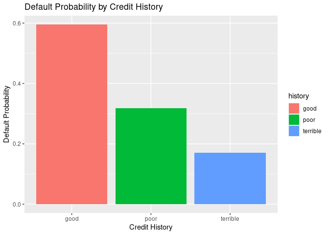

HW2
================
2023-02-20

## Question 1

### Improved linear Model

    ## [1] 65673.44

### KNN RMSE

    ## [1] 71127.13

The average RMSE for the linear model was lower in this case than the
average RMSE for the KNN model. However, since the KNN model was scaled,
it might not make sense to interpret these in comparison. For the taxing
authority, which model to use is dependent on the taxing system they
want to use. Using the standardized model, we interpret our predictions
in terms of how many standard deviations they are changing the price of
the house. If the taxing authority want to use more of a progressive
tax, this model may be better because it is measured in terms of how far
a house is from the mean (the number of standard deviations). However,
if the housing authority wants a more accurate prediction, it may make
sense to use the linear regression model as it is slightly more accurate
and can be interpreted in terms of price.

## Question 2

<!-- -->

    ## 
    ## Call:
    ## glm(formula = Default ~ duration + amount + installment + age + 
    ##     history + purpose + foreign, family = binomial(), data = ger)
    ## 
    ## Deviance Residuals: 
    ##     Min       1Q   Median       3Q      Max  
    ## -2.3464  -0.8050  -0.5751   1.0250   2.4767  
    ## 
    ## Coefficients:
    ##                       Estimate Std. Error z value Pr(>|z|)    
    ## (Intercept)         -7.075e-01  4.726e-01  -1.497  0.13435    
    ## duration             2.526e-02  8.100e-03   3.118  0.00182 ** 
    ## amount               9.596e-05  3.650e-05   2.629  0.00856 ** 
    ## installment          2.216e-01  7.626e-02   2.906  0.00366 ** 
    ## age                 -2.018e-02  7.224e-03  -2.794  0.00521 ** 
    ## historypoor         -1.108e+00  2.473e-01  -4.479 7.51e-06 ***
    ## historyterrible     -1.885e+00  2.822e-01  -6.679 2.41e-11 ***
    ## purposeedu           7.248e-01  3.707e-01   1.955  0.05058 .  
    ## purposegoods/repair  1.049e-01  2.573e-01   0.408  0.68346    
    ## purposenewcar        8.545e-01  2.773e-01   3.081  0.00206 ** 
    ## purposeusedcar      -7.959e-01  3.598e-01  -2.212  0.02694 *  
    ## foreigngerman       -1.265e+00  5.773e-01  -2.191  0.02849 *  
    ## ---
    ## Signif. codes:  0 '***' 0.001 '**' 0.01 '*' 0.05 '.' 0.1 ' ' 1
    ## 
    ## (Dispersion parameter for binomial family taken to be 1)
    ## 
    ##     Null deviance: 1221.7  on 999  degrees of freedom
    ## Residual deviance: 1070.0  on 988  degrees of freedom
    ## AIC: 1094
    ## 
    ## Number of Fisher Scoring iterations: 4

This model is showing that the worse that someone’s credit score, the
less probability they have of defaulting on a loan. However, this is not
the most accurate prediction given the data we are working with. Becuase
defaults are extremely oversampled in this dataset, when the surveyors
attempted to match cases, they looked at people with low and terrible
credit scores who did not default. Therefore, as they included more of
these individuals in the study, the probability of default relative to
credit score decreased. Similarly, it is likely that very few people
with a good credit score defaulted on loans, and so the ones included in
the survey make it seem like a higher probability than it actually was.
As such, this is not a good predictive model, and I would suggest to
make a predictive model the bank randomly samples all people taking out
loans.

## Question 3
