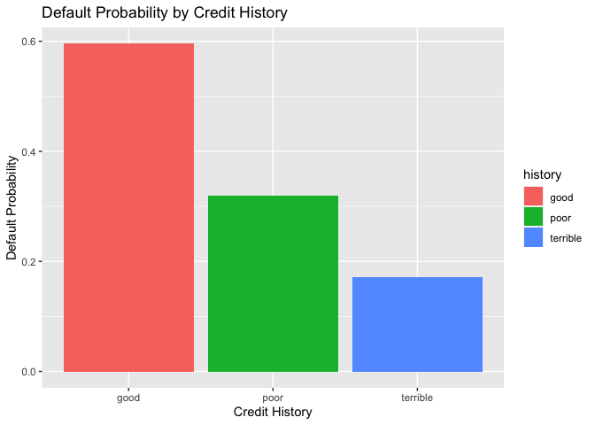
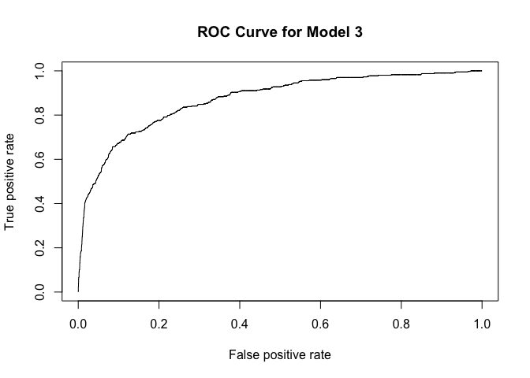

## Question 1


### Improved linear Model 

```
## [1] 65673.44
```


### KNN RMSE


```
## [1] 71127.13
```


The average RMSE for the linear model was lower in this case than the average RMSE for the KNN model.  However, since the KNN model was scaled, it might not make sense to interpret these in comparison.  For the taxing authority, which model to use is dependent on the taxing system they want to use.  Using the standardized model, we interpret our predictions in terms of how many standard deviations they are changing the price of the house.  If the taxing authority want to use more of a progressive tax, this model may be better because it is measured in terms of how far a house is from the mean (the number of standard deviations).  However, if the housing authority wants a more accurate prediction, it may make sense to use the linear regression model as it is slightly more accurate and can be interpreted in terms of price.  


## Question 2


<!-- -->


```
## 
## Call:
## glm(formula = Default ~ duration + amount + installment + age + 
##     history + purpose + foreign, family = binomial(), data = ger)
## 
## Deviance Residuals: 
##     Min       1Q   Median       3Q      Max  
## -2.3464  -0.8050  -0.5751   1.0250   2.4767  
## 
## Coefficients:
##                       Estimate Std. Error z value Pr(>|z|)    
## (Intercept)         -7.075e-01  4.726e-01  -1.497  0.13435    
## duration             2.526e-02  8.100e-03   3.118  0.00182 ** 
## amount               9.596e-05  3.650e-05   2.629  0.00856 ** 
## installment          2.216e-01  7.626e-02   2.906  0.00366 ** 
## age                 -2.018e-02  7.224e-03  -2.794  0.00521 ** 
## historypoor         -1.108e+00  2.473e-01  -4.479 7.51e-06 ***
## historyterrible     -1.885e+00  2.822e-01  -6.679 2.41e-11 ***
## purposeedu           7.248e-01  3.707e-01   1.955  0.05058 .  
## purposegoods/repair  1.049e-01  2.573e-01   0.408  0.68346    
## purposenewcar        8.545e-01  2.773e-01   3.081  0.00206 ** 
## purposeusedcar      -7.959e-01  3.598e-01  -2.212  0.02694 *  
## foreigngerman       -1.265e+00  5.773e-01  -2.191  0.02849 *  
## ---
## Signif. codes:  0 '***' 0.001 '**' 0.01 '*' 0.05 '.' 0.1 ' ' 1
## 
## (Dispersion parameter for binomial family taken to be 1)
## 
##     Null deviance: 1221.7  on 999  degrees of freedom
## Residual deviance: 1070.0  on 988  degrees of freedom
## AIC: 1094
## 
## Number of Fisher Scoring iterations: 4
```
This model is showing that the worse that someone's credit score, the less probability they have of defaulting on a loan.  However, this is not the most accurate prediction given the data we are working with.  Becuase defaults are extremely oversampled in this dataset, when the surveyors attempted to match cases, they looked at people with low and terrible credit scores who did not default.  Therefore, as they included more of these individuals in the study, the probability of default relative to credit score decreased.  Similarly, it is likely that very few people with a good credit score defaulted on loans, and so the ones included in the survey make it seem like a higher probability than it actually was. As such, this is not a good predictive model, and I would suggest to make a predictive model the bank randomly samples all people taking out loans. 

## Question 3


```r
hotels_dev = read_csv("Data/hotels_dev.csv")
```

```
## Rows: 45000 Columns: 22
## ── Column specification ────────────────────────────────────────────────────────
## Delimiter: ","
## chr   (9): hotel, meal, market_segment, distribution_channel, reserved_room_...
## dbl  (12): lead_time, stays_in_weekend_nights, stays_in_week_nights, adults,...
## date  (1): arrival_date
## 
## ℹ Use `spec()` to retrieve the full column specification for this data.
## ℹ Specify the column types or set `show_col_types = FALSE` to quiet this message.
```

```r
hotels_val = read.csv("Data/hotels_val.csv")

hotels_dev_split = initial_split(hotels_dev, prop = 0.8)
hotels_dev_train = training(hotels_dev_split)
hotels_dev_test = testing(hotels_dev_split)

m1_hotels_dev = lm(children ~ market_segment + adults + customer_type + is_repeated_guest, data = hotels_dev_train)
m2_hotels_dev = lm(children ~ . - arrival_date, data = hotels_dev_train)
#For our model we used a stepwise selection model using AIC
m3_hotels_dev = stepAIC(m2_hotels_dev, direction = "both", 
              trace = FALSE, k = log(36000))
```


##RMSE Test

```r
rmse(m1_hotels_dev, data = hotels_dev_test)
```

```
## [1] 0.2687505
```

```r
rmse(m2_hotels_dev, data = hotels_dev_test)
```

```
## [1] 0.2302231
```

```r
rmse(m3_hotels_dev, data = hotels_dev_test)
```

```
## [1] 0.2303419
```

```r
# While our RMSE test did not show significan improvement, the stability.simplicity of the resulting model is a welcomed improvement.
```
##Out-of-Sample Predict test

```r
phat_test_children1 = predict(m1_hotels_dev, hotels_dev_test, type = 'response')
yhat_test_children1 = ifelse(phat_test_children1 > 0.5, 1, 0)
confusion_m1 = table(y = hotels_dev_test$children, yhat = yhat_test_children1)
confusion_m1
```

```
##    yhat
## y      0
##   0 8269
##   1  731
```

```r
phat_test_children2 = predict(m2_hotels_dev, hotels_dev_test, type = 'response')
yhat_test_children2 = ifelse(phat_test_children2 > 0.5, 1, 0)
confusion_m2 = table(y = hotels_dev_test$children, yhat = yhat_test_children2)
confusion_m2
```

```
##    yhat
## y      0    1
##   0 8173   96
##   1  461  270
```

```r
phat_test_children3 = predict(m3_hotels_dev, hotels_dev_test)
yhat_test_children3 = ifelse(phat_test_children3 > 0.5, 1, 0)
confusion_m3 = table(y = hotels_dev_test$children, yhat = yhat_test_children3)
confusion_m3
```

```
##    yhat
## y      0    1
##   0 8176   93
##   1  459  272
```

```r
table(hotels_dev_test$children)
```

```
## 
##    0    1 
## 8269  731
```


```r
m1_accuracy = sum(diag(confusion_m1))/sum(confusion_m1)
m2_accuracy = sum(diag(confusion_m2))/sum(confusion_m2)
m3_accuracy = sum(diag(confusion_m3))/sum(confusion_m3)
null_accuracy = 8276/(8276+724)

m1_accuracy
```

```
## [1] 0.9187778
```

```r
m2_accuracy
```

```
## [1] 0.9381111
```

```r
m3_accuracy
```

```
## [1] 0.9386667
```

```r
null_accuracy
```

```
## [1] 0.9195556
```

```r
# Absolute Improvement 

m1_absimpr = m1_accuracy - null_accuracy
m2_absimpr = m2_accuracy - null_accuracy
m3_absimpr = m3_accuracy - null_accuracy

m1_absimpr
```

```
## [1] -0.0007777778
```

```r
m2_absimpr
```

```
## [1] 0.01855556
```

```r
m3_absimpr
```

```
## [1] 0.01911111
```

```r
# Lift

m1_lift = m1_accuracy/null_accuracy
m2_lift = m2_accuracy/null_accuracy
m3_lift = m3_accuracy/null_accuracy

m1_lift
```

```
## [1] 0.9991542
```

```r
m2_lift
```

```
## [1] 1.020179
```

```r
m3_lift
```

```
## [1] 1.020783
```


## Model Validation 

#Step 1

#ROC Curve


```r
m3_pred_values <- predict(m3_hotels_dev, hotels_val, type = "response")
m3_pred_data <- prediction(m3_pred_values, hotels_val$children)

roc_data <- performance(m3_pred_data, measure="tpr", x.measure="fpr")

plot(roc_data, main = "ROC Curve for Model 3")
```

<!-- -->


# Step 2 - creating K-fold


```r
k_folds = 20

hotels_val = hotels_val %>%
  mutate(fold_number = rep(1:k_folds, length = nrow(hotels_val)) %>% sample())

actual_children <- list()
expected_children <- list()
difference_children <- list()

for (x in 1:20) {
  fold <- hotels_val %>% 
    filter(fold_number == x)

phat <- predict(m3_hotels_dev, fold)

expected_children[[x]] <- round(sum(phat), 2)
actual_children [[x]] <- sum(fold$children)
difference_children[[x]] <- round(expected_children[[x]] - actual_children[[x]], 2)
}

fold_id = list(seq(1, 20, by=1))

predict_table = tibble("FOLD_ID" = unlist(fold_id), "EXPECTED" = unlist(expected_children), "ACTUAL" = unlist(actual_children), "DIFFERENCE" = unlist(difference_children))

predict_table
```

```
## # A tibble: 20 × 4
##    FOLD_ID EXPECTED ACTUAL DIFFERENCE
##      <dbl>    <dbl>  <int>      <dbl>
##  1       1     21.9     20       1.86
##  2       2     20.0     20      -0.03
##  3       3     21.0     24      -2.98
##  4       4     20.7     22      -1.31
##  5       5     23.0     22       0.97
##  6       6     20.9     19       1.9 
##  7       7     19.2     14       5.19
##  8       8     24.9     24       0.87
##  9       9     21.8     22      -0.2 
## 10      10     20.8     16       4.84
## 11      11     20.6     18       2.65
## 12      12     19.8     16       3.8 
## 13      13     24.2     21       3.25
## 14      14     19.6     23      -3.43
## 15      15     17.5     18      -0.46
## 16      16     18.4     21      -2.63
## 17      17     22.2     21       1.2 
## 18      18     22.2     19       3.17
## 19      19     20.2     23      -2.84
## 20      20     21.6     19       2.65
```
Our model appears to be failry consistent, when looking at the final difference between predictions and actual results. While overall the predicted results are probably acceptable, there are constant outliers after mulitple runs of the model.

